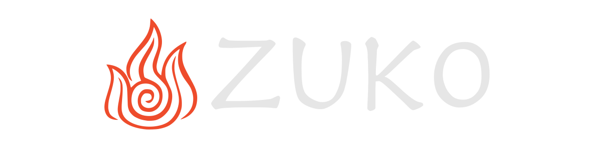

.. image:: images/banner.svg
   :class: only-light

Zuko
====

Zuko is a Python package that implements normalizing flows in PyTorch. It relies as much as possible on distributions and transformations already provided by PyTorch. Unfortunately, the `Distribution` and `Transform` classes of :mod:`torch` are not sub-classes of :class:`torch.nn.Module`, which means you cannot send their internal tensors to GPU with :py:`.to('cuda')` or retrieve their parameters with :py:`.parameters()`.

To solve this problem, :mod:`zuko` defines two abstract classes: :class:`zuko.flows.DistributionModule` and :class:`zuko.flows.TransformModule`. The former is any `Module` whose forward pass returns a `Distribution` and the latter is any `Module` whose forward pass returns a `Transform`. A normalizing flow is just a `DistributionModule` which contains a list of `TransformModule` and a base `DistributionModule`. This design allows for flows that behave like distributions while retaining the benefits of `Module`. It also makes the implementations easier to understand and extend.

Installation
------------

The :mod:`zuko` package is available on `PyPI <https://pypi.org/project/zuko>`_, which means it is installable via `pip`.

.. code-block:: console

    pip install zuko

Alternatively, if you need the latest features, you can install it from the repository.

.. code-block:: console

    pip install git+https://github.com/francois-rozet/zuko

Getting started
---------------

Normalizing flows are provided in the :mod:`zuko.flows` module. To build one, supply the number of sample and context features as well as the transformations' hyperparameters. Then, feeding a context :math:`y` to the flow returns a conditional distribution :math:`p(x | y)` which can be evaluated and sampled from.

.. code-block:: python

    import torch
    import zuko

    # Neural spline flow (NSF) with 3 sample features and 5 context features
    flow = zuko.flows.NSF(3, 5, transforms=3, hidden_features=[128] * 3)

    # Train to maximize the log-likelihood
    optimizer = torch.optim.AdamW(flow.parameters(), lr=1e-3)

    for x, y in trainset:
        loss = -flow(y).log_prob(x)  # -log p(x | y)
        loss = loss.mean()

        optimizer.zero_grad()
        loss.backward()
        optimizer.step()

    # Sample 64 points x ~ p(x | y*)
    x = flow(y_star).sample((64,))

References
----------

| Variational Inference with Normalizing Flows (Rezende et al., 2015)
| https://arxiv.org/abs/1505.05770

| Masked Autoregressive Flow for Density Estimation (Papamakarios et al., 2017)
| https://arxiv.org/abs/1705.07057

| Neural Spline Flows (Durkan et al., 2019)
| https://arxiv.org/abs/1906.04032

| Neural Autoregressive Flows (Huang et al., 2018)
| https://arxiv.org/abs/1804.00779

.. toctree::
    :caption: zuko
    :hidden:
    :maxdepth: 2

    api.rst

.. toctree::
    :caption: Development
    :hidden:
    :maxdepth: 1

    Contributing <https://github.com/francois-rozet/zuko/blob/master/CONTRIBUTING.md>
    Changelog <https://github.com/francois-rozet/zuko/releases>
    License <https://github.com/francois-rozet/zuko/blob/master/LICENSE>
